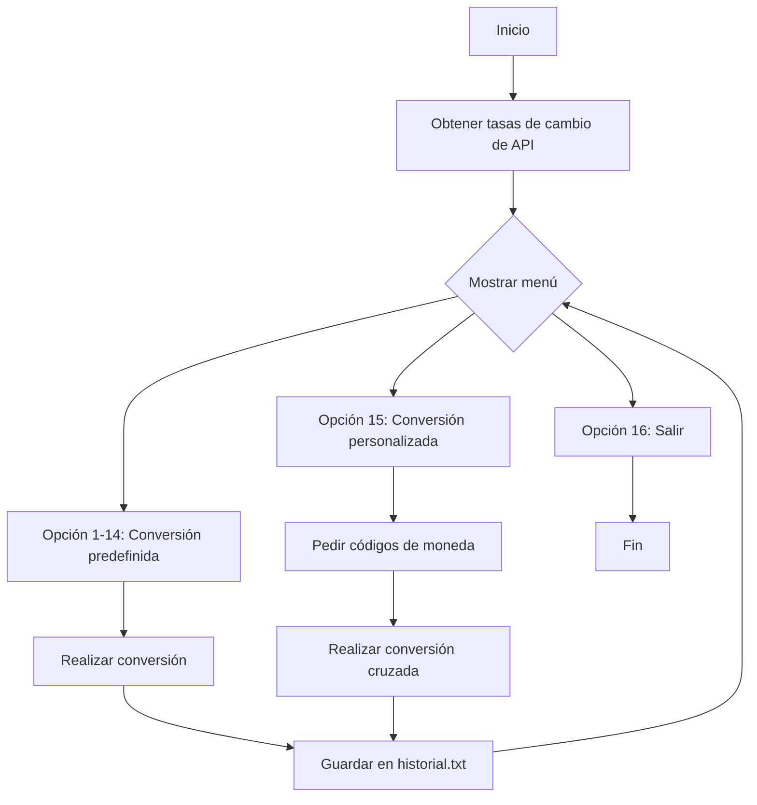

📝 Acerca de

Conversor de Monedas es un proyecto desarrollado como desafío final para el programa ONE (Oracle Next Education). Esta aplicación Java permite realizar conversiones entre múltiples monedas utilizando tasas de cambio actualizadas en tiempo real. El sistema consume datos de la API ExchangeRate-API y ofrece una interfaz intuitiva en consola para realizar conversiones entre las principales divisas del mundo, con capacidad para manejar más de 160 monedas diferentes.

✨ Características Principales

- ✅ Conversiones predefinidas entre las monedas más utilizadas (USD, EUR, ARS, BRL, COP, MXN, CLP)

- 🌍 Conversión entre cualquier par de monedas disponibles en la API

- 📝 Historial completo de todas las conversiones realizadas

- ⏰ Registro con marca de tiempo para cada operación

- 🔄 Tasas de cambio actualizadas en tiempo real

- 🛠️ Manejo robusto de errores y validación de entradas

🚀 Cómo Funciona

🔧 Tecnologías Utilizadas

- Java 24 - Lenguaje principal

- Gson - Para procesamiento de JSON

- HttpClient - Para conexión con API

- ExchangeRate-API - Fuente de tasas de cambio

📥 Instalación y Ejecución

- Clona el repositorio: git clone https://github.com/Ciclido233/ConversorDeMonedas-Java.git

- Importa el proyecto en IntelliJ IDEA

- Asegúrate de tener el JDK 24 configurado

- Agrega la librería Gson (gson-2.10.1.jar) al classpath

- Ejecuta la clase Principal.java

📁 Estructura del Proyecto

conversor-moneda/

├── src/

│   ├── Principal.java           # Punto de entrada

│   └── Moneda.java              # Modelo de datos para tasas

├── lib/

│   └── gson-2.10.1.jar          # Librería Gson

├── historial_conversiones.txt    # Historial de operaciones

└── README.md

🌟 Características Avanzadas

Historial de Conversiones

Todas las operaciones se guardan en historial_conversiones.txt con formato:

[2023-08-15 14:30:25] El valor 100.00 [USD] => 809.75 [BRL]

[2023-08-15 14:32:10] El valor 50.00 [EUR] => 55.23 [USD]
